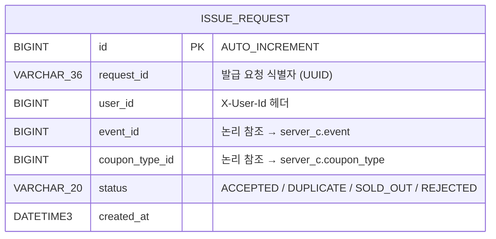
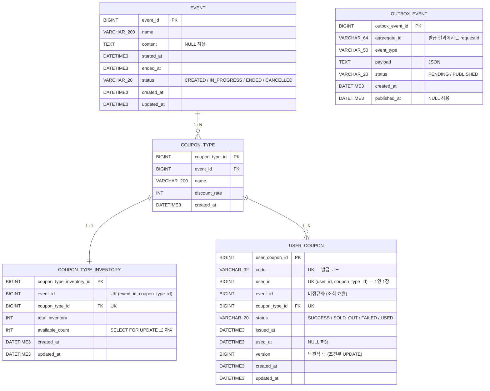

# ERD / 데이터 모델

## 📚 문서 목록

- [시스템 아키텍처](architecture.md)
- **ERD / 데이터 모델** ← 현재 문서
- [API 명세](api-spec.md)
- [기술 결정 기록](../decisions/README.md)

[← README](../../README.md)

---

저장소는 서비스별로 분리한다 (Database per Service). 인스턴스 사이에 **물리 FK 는 없다** —
`user_id`, `event_id`, `coupon_type_id` 는 같은 의미의 논리 키지만 FK 는 스키마 안에서만 정의한다.

| 인스턴스 | 포트 | Schema | 책임 |
|---|---|---|---|
| MySQL-A | 3306 | `server_a` | 발급 요청 감사 로그 |
| MySQL-C | 3307 | `server_c` | 이벤트 / 쿠폰 마스터 / 재고 / 발급 결과 / Outbox |

---

## MySQL-A — 요청 감사 로그

A 가 받은 모든 발급 요청을 요청당 한 번 커밋한다. 발급 결과의 권위는 C 에 있고,
이 테이블은 입력 트래픽의 흔적만 남긴다.

인덱스: `idx_issue_request_user(user_id)`, `idx_issue_request_request_id(request_id)`

`(user_id, coupon_type_id)` UNIQUE 를 여기에 두지 않는다 — 멱등 권위는 C 다.

---

## MySQL-C — 재고 권위 + 발급 결과

### 핵심 제약

| 테이블 | 제약 | 의미 |
|---|---|---|
| `coupon_type_inventory` | `uk_inventory_event_type (event_id, coupon_type_id)` | 재고 row 의 단일성 |
| `user_coupon` | `uk_user_coupon_user_type (user_id, coupon_type_id)` | **1인 1장 + 중복 메시지 차단** |
| `user_coupon` | `uk_user_coupon_code (code)` | 발급 코드 유일성 |

### 인덱스

| 테이블 | 인덱스 | 용도 |
|---|---|---|
| `event` | `idx_event_status(status)` | 캐시 갱신이 IN_PROGRESS 만 스캔 |
| `user_coupon` | `idx_user_coupon_user(user_id)` | 내 쿠폰 목록 |
| `outbox_event` | `idx_outbox_status_created(status, created_at)` | poller 가 PENDING 을 시간순 조회 |

### 구현 시 주의

- 상태 컬럼은 `VARCHAR(20)` 이다. TypeORM `type: 'enum'` 은 MySQL `ENUM` 을 만들어 스키마가 달라진다
- 시각은 전부 `DATETIME(3)`, DataSource 에 `timezone: 'Z'` 필수
- BIGINT 는 mysql2 가 **문자열**로 반환한다. 매퍼에서 한 번만 정규화한다
- `version` 은 `@VersionColumn` 이 아니라 평범한 `@Column` 이다 ([동시성 제어](../reports/concurrency.md))

---

## Redis (server-b / server-c)

| 키 | 자료구조 | TTL | 쓰는 쪽 → 읽는 쪽 |
|---|---|---|---|
| `issue:pending:{userId}:{couponTypeId}` | Hash | 24h | b → b |
| `issue:pending:zset` | ZSet | — | b → b |
| `event:{eventId}` | String (JSON) | 5분 | c → c |
| `coupon:available:{eventId}:{couponTypeId}` | String (존재=매진) | 24h | **c → a** |

- pending Hash 필드: `requestId`, `userId`, `eventId`, `couponTypeId`, `status`, `createdAt`, `code`, `publishAttempts`, `lastPublishedAt`
- ZSet member: `"{userId}:{couponTypeId}"`, score: `lastPublishedAt`(최초엔 `createdAt`) epoch ms
- `coupon:available:*` 은 **서비스 간 계약**이다 — C 가 쓰고 A 가 읽는다

---

## Kafka

| 토픽 | 방향 | key | payload |
|---|---|---|---|
| `coupon-issue-request` | b → c | `userId` | `requestId`, `userId`, `eventId`, `couponTypeId`, `requestedAt` |
| `coupon-issue-result` | c → b | `requestId` | `requestId`, `userId`, `eventId`, `couponTypeId`, `status`, `couponCode`, `processedAt` |

- 파티션 3, replication-factor 1, 자동 생성 비활성 (앱이 명시 생성)
- request 의 key 가 `userId` 인 이유: 같은 사용자의 이벤트에 파티션 순서 보장
- result 의 key 는 `outbox_event.aggregate_id` = `requestId`
